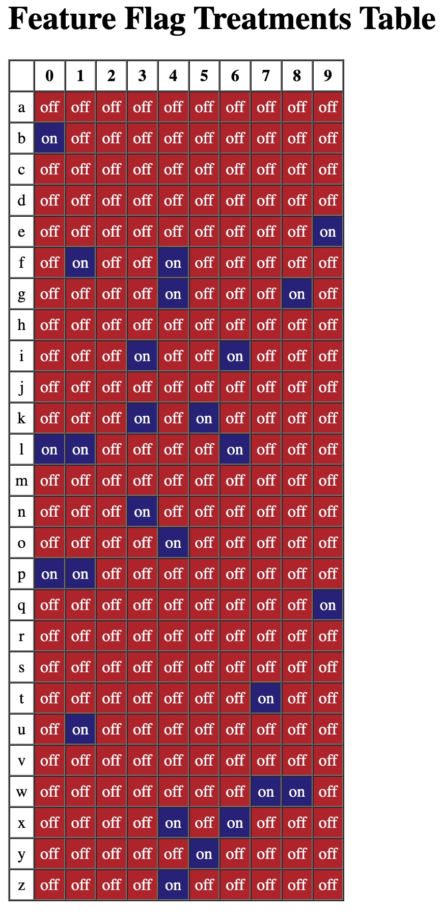

# Feature Flags with Harness Ruby SDK

Uses the FME Ruby SDK to paint an m x n bank of boxes, where each box has a unique letter and number identifying it to FME.  A single "new_onboarding" flag determines which boxes are enables.  Color coding and "on" or "off" text indicate the state of the flag for each user/box.

e.g. http://localhost:8000/feature_flags/show_treatments

Consult https://help.split.io/hc/en-us/articles/360020673251-Ruby-SDK for full Ruby SDK documentation.

Author: david.martin@harness.io
